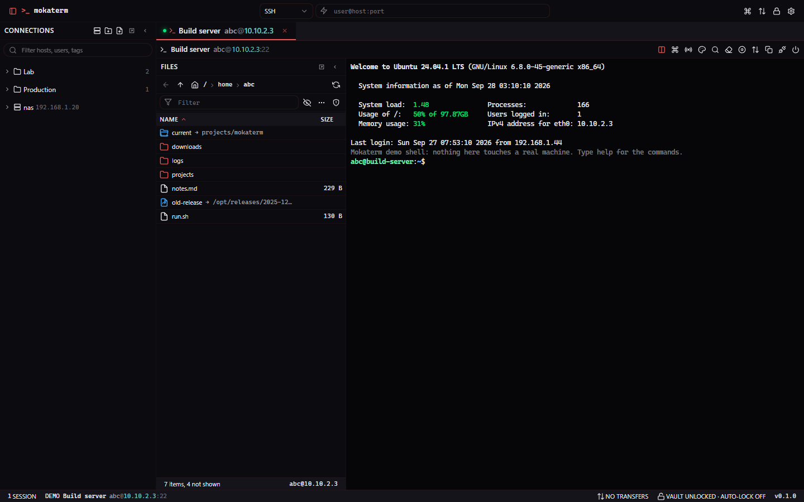
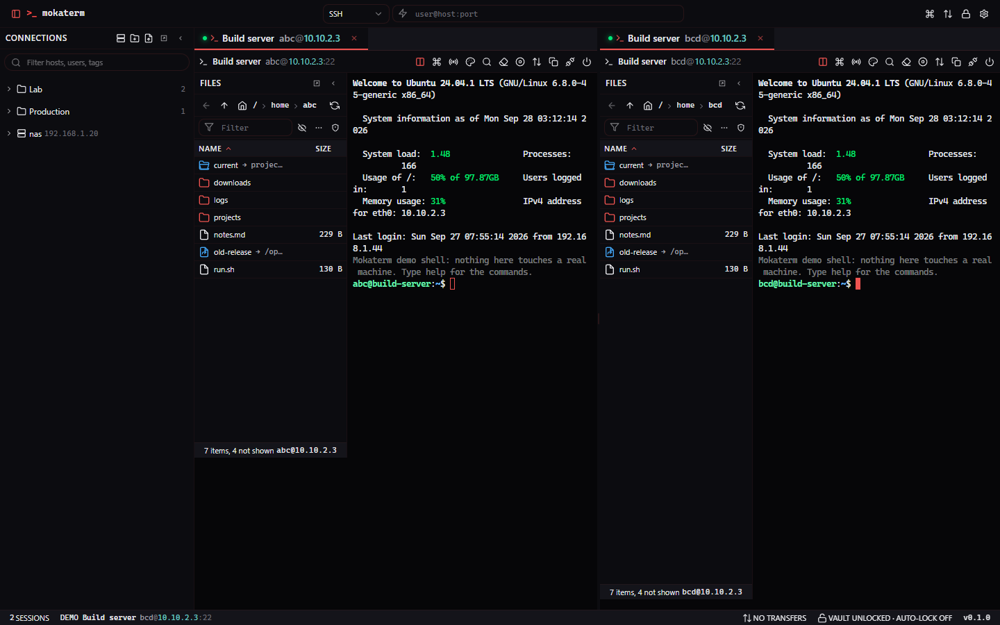
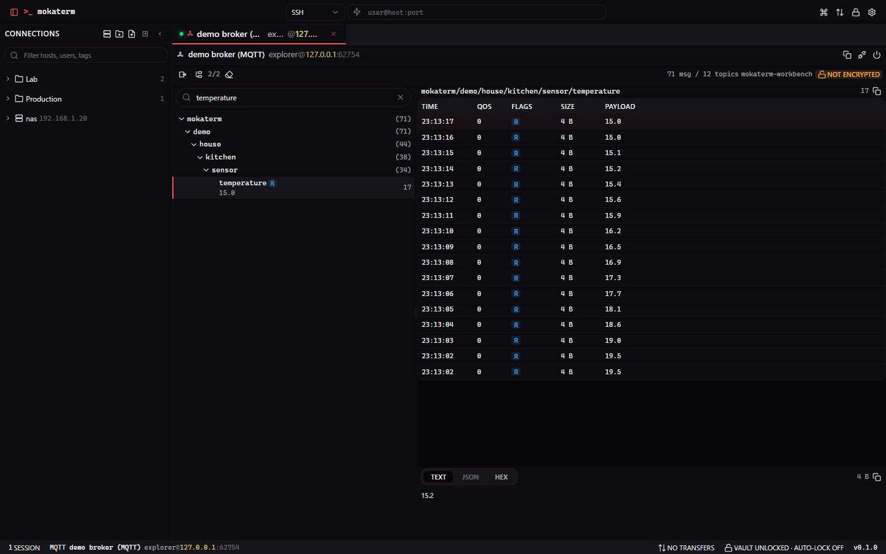
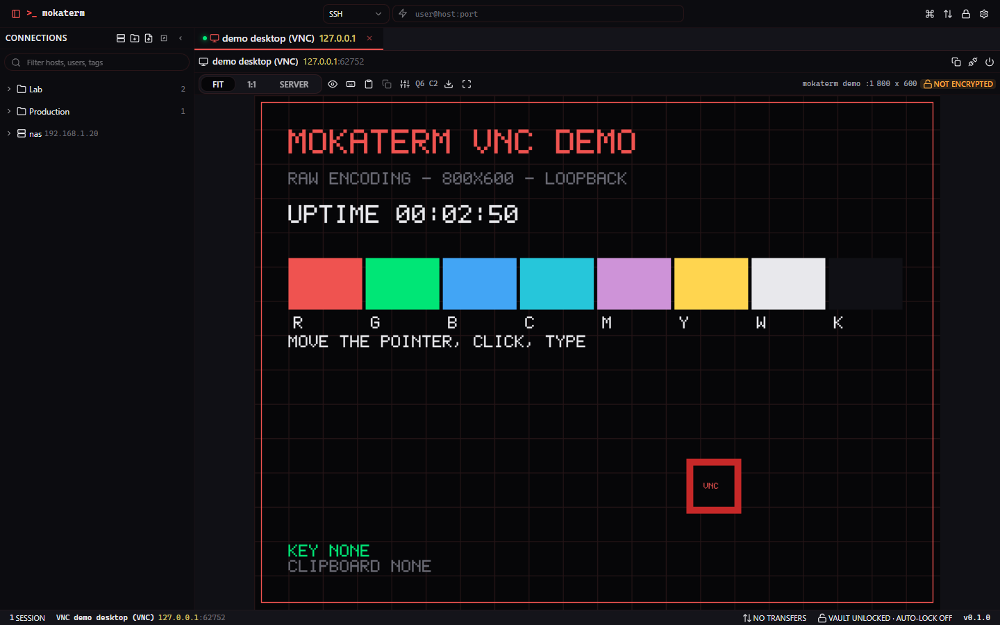
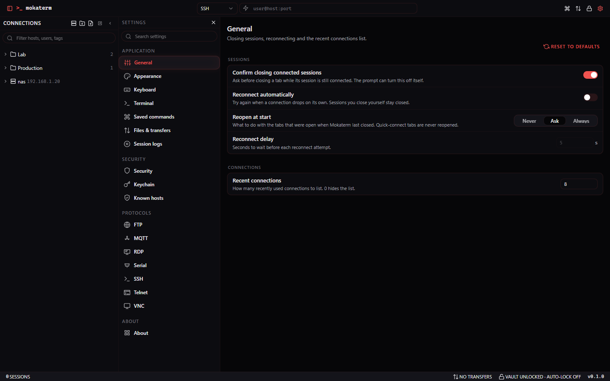
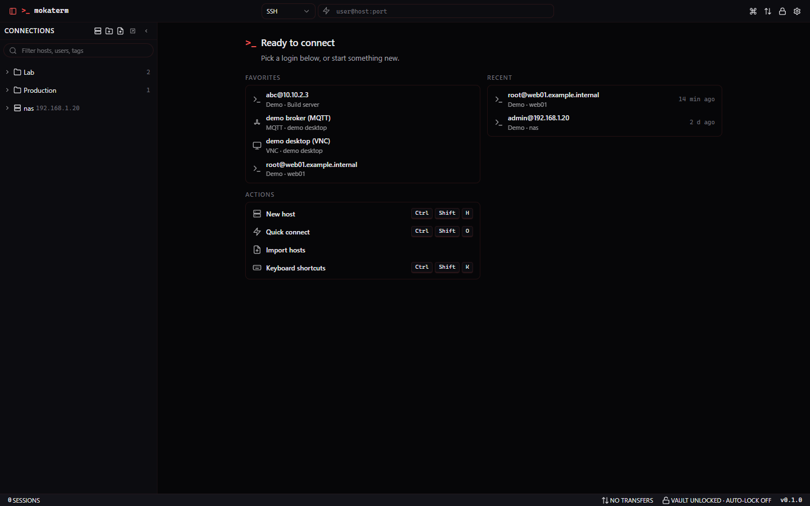

# Mokaterm

[](https://github.com/jacobwi/Mokaterm/actions/workflows/ci.yml)

A modular SSH, SFTP, FTP, VNC, RDP, telnet, serial and MQTT client, written in Blazor on .NET 10.
One shared UI runs on two hosts: a MAUI desktop app for Windows, and a Blazor Server web app where
the server makes the connections instead of the browser.



## Protocols

| Protocol | Terminal | Files | Notes |
|---|---|---|---|
| SSH | yes | SFTP | Port forwarding, jump hosts, SSH agent, sudo file operations, HTTP and SOCKS proxies |
| SFTP | | yes | The file browser half of an SSH login |
| FTP / FTPS | | yes | Explicit and implicit TLS, the same proxy kinds as SSH |
| VNC | | | The RFB handshake and authentication run in .NET; the page only draws |
| RDP | | | IronRDP in .NET; the page draws decoded regions on a canvas |
| Telnet | yes | | RFC 1143 option negotiation, written here rather than taken from a package |
| Serial | yes | | Line settings and control pins over `System.IO.Ports`. Desktop only |
| MQTT | | | Topic tree, payload viewer and publishing against a broker |

Serial is not offered on the web host on purpose: it would hand the server's own ports to whoever
opens the page.

## Screenshots

Tabs split across two panes, each with its own file browser:



The MQTT explorer, with a topic selected and its payload below:



A VNC session:



Settings, including a page for every protocol module:



The home screen, with favorites, recent logins and the keys bound to each action:



## Install

Grab the latest [release](https://github.com/jacobwi/Mokaterm/releases). `Setup.exe` installs for the
current user, needs no administrator, and keeps itself updated once an update feed is set.
The portable zip is the same build without an installer.

Windows 10 1809 (build 17763) or later, x64.

**These builds are not code signed.** SmartScreen shows "Windows protected your PC" before Setup runs:
pick **More info**, then **Run anyway**. Where Smart App Control is on, it blocks the file outright.

Settings, the vault and session logs live in `%LOCALAPPDATA%\Mokaterm`. The app installs to
`%LOCALAPPDATA%\Moka.Mokaterm`, and uninstalling removes only that folder.

## Build

```bash
dotnet build Mokaterm.slnx
dotnet test --solution Mokaterm.slnx

# The web host
dotnet run --project src/Hosts/Mokaterm.Web --launch-profile http     # http://localhost:5080

# The desktop host
dotnet build src/Hosts/Mokaterm.Maui -f net10.0-windows10.0.19041.0

# The installer
powershell -NoProfile -ExecutionPolicy Bypass -File build/package-windows.ps1
```

`samples/Mokaterm.DevHost` runs the real shell against demo SSH, telnet, VNC and MQTT servers with an
auto-unlocked throwaway vault, which is where the screenshots above come from. It refuses to start
outside Development.

## How it is put together

Everything crosses a boundary through an interface in `Mokaterm.Abstractions`, which holds contracts
and nothing else: no UI, no third-party packages.

```
Mokaterm.Abstractions   contracts
Mokaterm.Core           vault and crypto, stores, connections, credentials, settings, themes
Mokaterm.Sessions       protocol registry, session manager, terminal pump, transfer queue
UI/*                    shell, terminal view, file browser, settings pages, shared components
Modules/*               one project per protocol
Hosts/*                 MAUI desktop, Blazor Server web
```

A protocol module references the shared UI library and its own protocol package, and nothing else of
ours. It declares what it can do through a `ProtocolDescriptor`, and a session hands features out
through `GetFeature<T>()`: a terminal channel gets the built-in terminal view, a file system feature
gets the built-in file browser, and anything else brings its own view.

## Security

- The vault header derives a key with Argon2id (64 MiB, t 3, p 4) that wraps a random 256-bit data key
  with AES-GCM. Changing the master password re-wraps the data key alone.
- Every vault document is AES-GCM encrypted with associated data binding the vault id and the document
  name. Passwords, keys and passphrases are encrypted again per field.
- Hostnames and usernames never reach a plain file, and `settings.json` holds no secrets.
- Unlock attempts are throttled, the vault auto-locks when idle, copied secrets are cleared from the
  clipboard, and decrypted material sits in pinned memory that is wiped.
- SSH host keys and TLS certificates go through one trust check with an Ask, Accept new or Strict policy.
- On the desktop, "unlock with this device" stores the data key under DPAPI for the current Windows user.

The web host gives shell access to every saved host, so run it over HTTPS and preferably behind an
authenticating reverse proxy.

## Status

Early. The desktop host is the one that gets used; the web host works but has seen less mileage.
RDP has never met a real server, and serial has never met real hardware: both ship because the rest of
the app does not wait on them, not because they are finished.

## Third-party

noVNC (MPL-2.0) and xterm.js (MIT) are vendored under `wwwroot/lib` with their own licence files.
The Mokaterm patches applied to noVNC are listed at the top of `vnc.js`.
